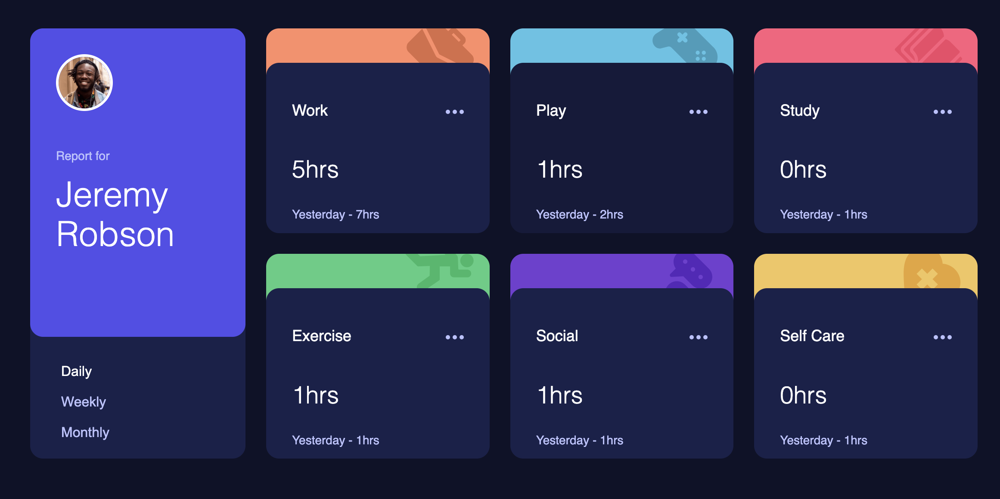

# Frontend Mentor - Time tracking dashboard solution

This is a solution to the [Time tracking dashboard challenge on Frontend Mentor](https://www.frontendmentor.io/challenges/time-tracking-dashboard-UIQ7167Jw). Frontend Mentor challenges help you improve your coding skills by building realistic projects.

## Table of contents

- [Overview](#overview)
  - [The challenge](#the-challenge)
  - [Screenshot](#screenshot)
  - [Links](#links)
  - [Built with](#built-with)
  - [Continued development](#continued-development)
- [Author](#author)
- [Acknowledgments](#acknowledgments)

**Note: Delete this note and update the table of contents based on what sections you keep.**

## Overview

A time-tracking-dashboard where users can track their daily, weekly, and monthly stats activities.

### The challenge

Users should be able to:

- View the optimal layout for the site depending on their device's screen size
- See hover states for all interactive elements on the page
- Switch between viewing Daily, Weekly, and Monthly stats

### Screenshot

### Links

- Solution URL: [Add solution URL here](https://www.frontendmentor.io/challenges/time-tracking-dashboard-UIQ7167Jw)
- Live Site URL: [Add live site URL here](https://tech-badhead.github.io/Time-tracking-dashboard/)

### Built with

- Semantic HTML5 markup
- CSS custom properties
- Flexbox
- CSS Grid
- Vanilla JS

### Continued development

I just want to continue improving my javascript knowledge

## Author

- Frontend Mentor - [@Tech-Badhead](https://www.frontendmentor.io/profile/Tech-Badhead)
- Twitter - [@yAkeemUsman10482](https://www.twitter.com/akeemusman10482)

## Acknowledgments

Hat off to all the free resources online out there, they really made the difference for me in completeing the challenge.
